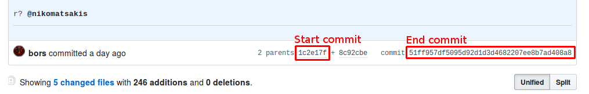

# Bot usage

Crater can be controlled in the rust-lang/rust repo thanks to the GitHub bot
[@craterbot](https://github.com/craterbot). The bot replies to every command in
the comments of issues and pull requests, if the command is in its own line and
is prefixed with the bot's username.

For example, to check if the bot is alive you can write this comment:

```
@craterbot ping
```

And the bot will reply to you.

## Table of Contents

[h-toc]: #table-of-contents

* [Tutorial: creating an experiment for a PR][h-tutorial]
* [Available experiment modes][h-experiment-modes]
* [Automatic experiment names][h-experiment-names]
* Commands reference:
  * [Creating experiments][h-cmd-run]
  * [Editing experiments][h-cmd-edit]
  * [Aborting experiments][h-cmd-abort]
* Troubleshooting:
  * [Regenerating a report if it failed][h-troubleshooting-retry-report]
  * [Reload the list of GitHub team members][h-troubleshooting-reload-teams]

## Tutorial: creating an experiment for a PR

[h-tutorial]: #tutorial-creating-an-experiment-for-a-pr

When you want to create an experiment to check if a PR is breaking some
third-party code, the first thing is to request a **try build** to get a valid
toolchain. You can do that with the `@bors try` GitHub comment.

**After** the try build is done you need to choose the [experiment mode you want to
use][h-experiment-modes] and type up the command in your GitHub PR:

```
@craterbot check
```

This is a shorthand for:

```
@craterbot run mode=check-only
```

For more on available modes, [read on][h-experiment-modes].

If you don't want to do a Crater run with the last try build but with an older
one, you need to get the SHA of the start and end commits. Bors should have
posted a comment like this in the thread:

> ⌛ Trying commit XXXXXXX with merge YYYYYYY...

The end commit is `YYYYYYY`, while the start commit is the first of its two
parents (both should be merge commits by bors):



You must prefix the start commit with `master#`, and the end commit with
`try#`, and both of them should be written with the full 40-chars hash.

Then you need to choose the [experiment mode you want to
use][h-experiment-modes] and type up the command in your GitHub PR:

```
@craterbot run start=master#fullhash end=try#fullhash mode=YOUR-MODE
```

[Go back to the TOC][h-toc]

## Available experiment modes

[h-experiment-modes]: #available-experiment-modes

The following experiment modes are currently available:

* `build-and-test`: run `cargo build` and `cargo test` on every crate
* `build-only`: run `cargo build` on every crate
* `check-only`: run `cargo check` on every crate (faster)
* `clippy`: run `cargo clippy` on every crate
* `rustdoc`: run `cargo doc --no-deps` on every crate

The mode you should use depends on what your experiment is testing:

* If your PR rejects some code that was previously accepted you can use
 `check-only` (or `build-only` if the change involves codegen or later
  compilation stages)
* Otherwise just use `build-and-test`, even if it will be slower to run

[Go back to the TOC][h-toc]

## Available crate selections

By default, your experiment will be run on all crates known to Crater.
However, it is possible to run an experiment on a subset of the ecosystem by
passing a different value to `crates`. The following options are currently
available:

* `full`: run the experiment on every crate.
* `top-{n}`: run the experiment on the `n` most downloaded crates on
  [crates.io](crates.io) (e.g. `top-100`).
* `random-{n}`: run the experiment on `n` randomly selected crates (e.g. `random-20`).
* `list:{...}`: run the experiment on the specified crates.

For `list:`, the value after the colon can either be a comma-separated list of
crates to run or a link to a newline-separated list of crates ([example][list]).
For example, `list:lazy_static,brson/hello-rs` and `list:https://git.io/Jes7o`
will both run an experiment on the `lazy_static` crate and the git repo at
`github.com/brson/hello-rs`. A link must begin with `http[s]://`.

[list]: https://gist.githubusercontent.com/ecstatic-morse/837c558b63fc73ab469bfbf4ad419a1f/raw/example-crate-list

[Go back to the TOC][h-toc]

## Automatic experiment names

[h-experiment-names]: #automatic-experiment-names

Crater tries to predict what the name of the experiment you're working on is,
and in those cases you aren't required to explicitly provide one during
commands. At the moment, the name is predicted in these cases:

* If you already used a name in the issue/PR, that name is reused by default
  for future requests
* If you didn't use a name before and you're in a PR, `pr-NUMBER` is used as
  default (for example `pr-12345`)

[Go back to the TOC][h-toc]

## Experiment requirements

Crater uses a system of requirements and capabilities to control which class of
agent can run which experiments. For now, there are two classes of agents:
Linux agents have the capability `linux`, and Windows agents have the
capability `windows`. You must specify a requirement for your experiment
(either `linux` or `windows`), and your experiment will only run on agents with
that capability.

### Specifying Toolchains

Crater allows some configurations to the toolchains used in an experiment.
You can specify a toolchain using a rustup name or `branch#sha`, and use the
following flags:
* `+rustflags={flags}`: sets the `RUSTFLAGS` environment variable to `{flags}` when
  building with this toolchain, e.g. `+rustflags=-Zverbose`
* `+patch={crate_name}={git_repo_url}={branch}`: patches all crates built by
  this toolchain to resolve the given crate from the given git repository and branch.

## Commands reference

### Creating experiments

[h-cmd-run]: #creating-experiments

You can create experiments with the `run` command. For example, to create a
beta run you can use:

```
@craterbot run name=foobar start=stable end=beta cap-lints=allow
```

* `name`: name of the experiment; required only if Crater [can't determine it
  automatically][h-experiment-names]
* `start`: the first toolchain; see [specifying toolchains](#specifying-toolchains)
  (required if no try build is automatically detected)
* `end`: the second toolchain; see [specifying toolchains](#specifying-toolchains)
  (required if no try build is automatically detected)
* `mode`: the experiment mode (default: `build-and-test`)
* `crates`: the selection of crates to use (default: `full`)
* `cap-lints`: the lints cap (default: `forbid`, which means no cap)
* `ignore-blacklist`: whether the blacklist should be ignored (default: `false`)
* `requirement`: any requirement of the agent running the experiment (default: `linux`)
* `assign`: assign the experiment to a specific agent (use this only when you
  know what you're doing)
* `p`: the priority of the run (default: `0`)

[Go back to the TOC][h-toc]

### Editing experiments

[h-cmd-edit]: #creating-experiments

Experiments can be edited as long as they're queued. To edit an experiment,
send a command with the options you want to change. For example, to change the
priority of the `foo` experiment you can use:

```
@craterbot name=foo p=1
```

* `name`: name of the experiment; required only if Crater [can't determine it
  automatically][h-experiment-names]
* `start`: the first toolchain; see [specifying toolchains](#specifying-toolchains)
  (required if no try build is automatically detected)
* `end`: the second toolchain; see [specifying toolchains](#specifying-toolchains)
  (required if no try build is automatically detected)
* `mode`: the experiment mode (default: `build-and-test`)
* `crates`: the selection of crates to use (default: `full`)
* `cap-lints`: the lints cap (default: `forbid`, which means no cap)
* `ignore-blacklist`: whether the blacklist should be ignored (default: `false`)
* `requirement`: any requirement of the agent running the experiment (default: `linux`)
* `assign`: assign the experiment to a specific agent (use this only when you
  know what you're doing)
* `p`: the priority of the run (default: `0`)

[Go back to the TOC][h-toc]

### Aborting experiments

[h-cmd-abort]: #aborting-experiments

If you don't want to run an experiment anymore, you can use the `abort`
command. For example, to abort an experiment named `foo` you can use:

```
@craterbot abort name=foo
```

* `name`: name of the experiment; required only if Crater [can't determine it
  automatically][h-experiment-names]

[Go back to the TOC][h-toc]

## Troubleshooting

Crater allows some troubleshooting actions to be done directly from the bot.
These steps should only be performed by the infra team though.

### Regenerating a report if it failed

[h-troubleshooting-retry-report]: #regenerating-a-report-if-it-failed

If a report generation failed, the first thing to do should be to read the
server logs and fix the problem (tip: the server logs contains the full error
message). After doing that it's possible to restart the report generation
without restarting the whole experiment, with the GitHub command
`retry-report`:

```
@craterbot retry-report name=foo
```

* `name`: name of the experiment; required only if Crater [can't determine it
  automatically][h-experiment-names]

[Go back to the TOC][h-toc]

## Reload the list of GitHub team members

[h-troubleshooting-reload-teams]: #reload-the-list-of-github-team-members

Crater allows members of some teams (configured in `config.toml`) to interact
with the GitHub bot, but the list of members is only loaded at startup. If a
member joined or was removed from a team, you need to reload that list.

It's possible to reload the list either restarting the Crater server or using
the `reload-acl` command, which requires no arguments:

```
@craterbot reload-acl
```

[Go back to the TOC][h-toc]
